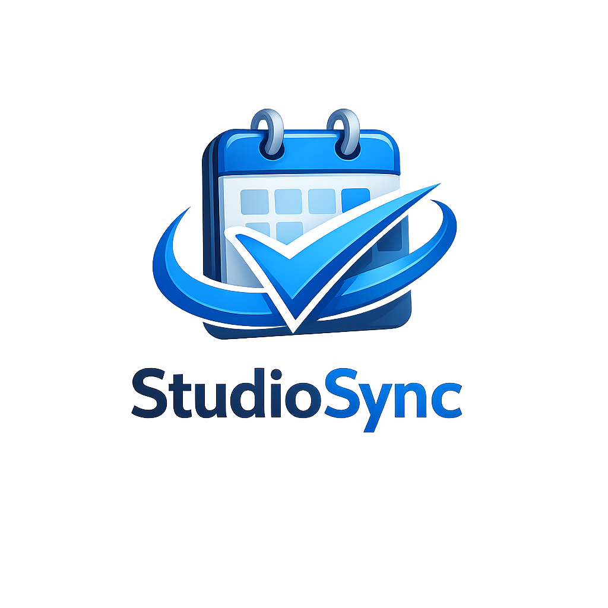
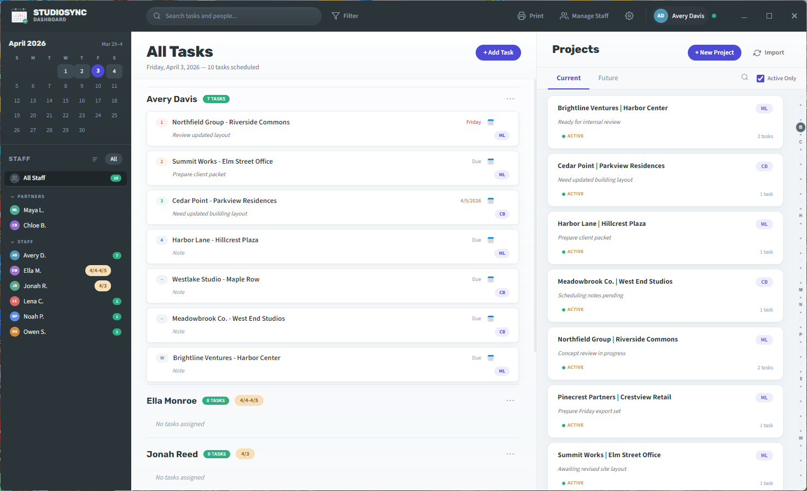
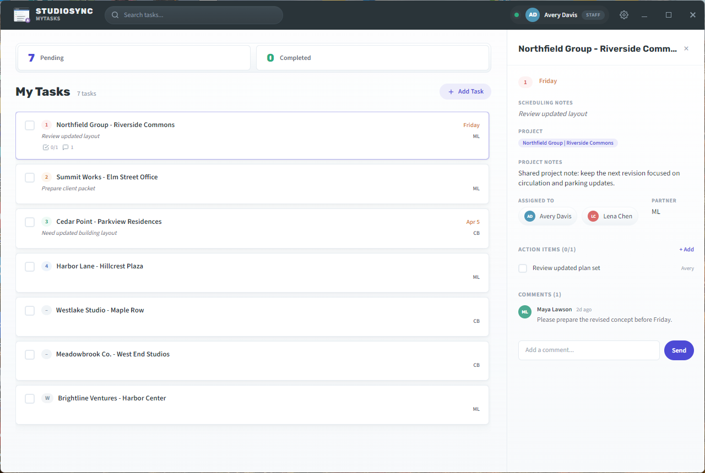

<p align="center">
  
</p>

# StudioSync

StudioSync is a two-app Windows scheduling system for small production and professional-services teams that need a clear daily board in the office and a lighter personal workspace on each desktop.

- `StudioSync` is the main dashboard used to plan work, manage people, import projects, and publish office-wide updates.
- `StudioSync MyTasks` is the companion app used by partners and staff to track assigned work, add follow-up notes, and stay in sync with the main board.

Both apps are Electron-based, store data locally in SQLite, and synchronize through a shared-drive event system instead of a central server database.

## Product overview

### StudioSync

StudioSync is the source of truth for the office schedule. It is designed for the team member who needs to see staffing, assignments, and project load all at once.

Core capabilities:

- Create, assign, prioritize, confirm, and reorder tasks across the team
- View staff workload with task counts, PTO indicators, and drag-and-drop assignment
- Import and refresh projects from Excel
- Add new projects directly into the current or future list from the dashboard
- Manage custom priorities, business roles, and user records
- Export the schedule as PDF and HTML for office-wide visibility
- Configure a shared update folder used by both apps
- Run the weekly rollover flow to carry unfinished work forward cleanly
- Start in a compact branded sign-in window before expanding into the full dashboard
- Install through a current-user installer flow that seeds the default path under `C:\SD Apps`



### StudioSync MyTasks

StudioSync MyTasks is the day-to-day desktop companion. It gives users a focused workspace for the items they need to finish without the admin-heavy controls of the main dashboard.

Core capabilities:

- View shared assignments synced from StudioSync
- See the full assigned team and shared comment thread for project-linked tasks
- Track private partner tasks that stay local to that install
- Review and edit project details and project notes from the companion app (partner view)
- Add partner-managed projects into the current or future list from MyTasks
- Open task details with Action Items and comments
- Filter by pending, completed, or overdue work
- Search task titles and notes quickly
- Let partners see staff workload from the companion app
- Show assigned staff avatars on partner project cards and manage those projects from a right-click menu
- Let selected staff add project-linked tasks to their own list
- Let selected staff adjust priority on their own shared tasks
- Detect new installers from the shared update folder
- Start in a compact branded sign-in window that mirrors the StudioSync auth flow



## How the apps work together

The two apps are meant to be used as a matched system:

- The main dashboard manages office-wide planning and shared data.
- Dashboard project creation follows the active Current/Future tab, and future projects can be promoted into the current list from the project menu.
- Each MyTasks install keeps a local cache and syncs changes through shared-drive event files.
- Shared tasks, Action Items, comments, project notes, and settings stay aligned across installs.
- Project-linked comments in MyTasks are shared across the staff assigned to that same project.
- Project-linked Action Items in MyTasks are shared across the staff assigned to that same project.
- Partner My Projects keeps its header fixed while the project list scrolls, matching the task-list behavior.
- Private tasks in MyTasks remain local and are never pushed back to the office schedule.

## Repository layout

```text
.
|-- sd-scheduling/    # StudioSync main dashboard
|-- sd-companion/     # StudioSync MyTasks companion app
|-- .github/workflows/
|-- docs/
|-- DESIGN.md
|-- STRUCTURE.md
`-- README.md
```

More detailed architecture and file layout notes live in [`DESIGN.md`](DESIGN.md) and [`STRUCTURE.md`](STRUCTURE.md).

## Local development

Build StudioSync:

```powershell
cd sd-scheduling
npm ci
npm run build
```

Build StudioSync MyTasks:

```powershell
cd sd-companion
npm ci
npm run build
```

## GitHub releases

GitHub Actions is configured in [`.github/workflows/release-signpath.yml`](.github/workflows/release-signpath.yml) to:

1. build both Windows installers on GitHub-hosted runners
2. upload the unsigned installers as workflow artifacts
3. package both `win-unpacked` folders as zip downloads
4. publish the unsigned installers and win-unpacked zip packages to the GitHub release for version tags

Push a tag like `v1.0.4` to publish the current unsigned release assets. Keep the SignPath setup notes below if you want to restore signed releases later.

The interactive installers currently force current-user install mode and seed default locations under `C:\SD Apps\StudioSync` and `C:\SD Apps\StudioSync MyTasks`.

## SignPath setup

Setup details for restoring signed releases later are documented in [`docs/signpath-setup.md`](docs/signpath-setup.md).

## Screenshot note

The screenshots in this README use fictional demo users, project names, and notes created specifically for documentation.
