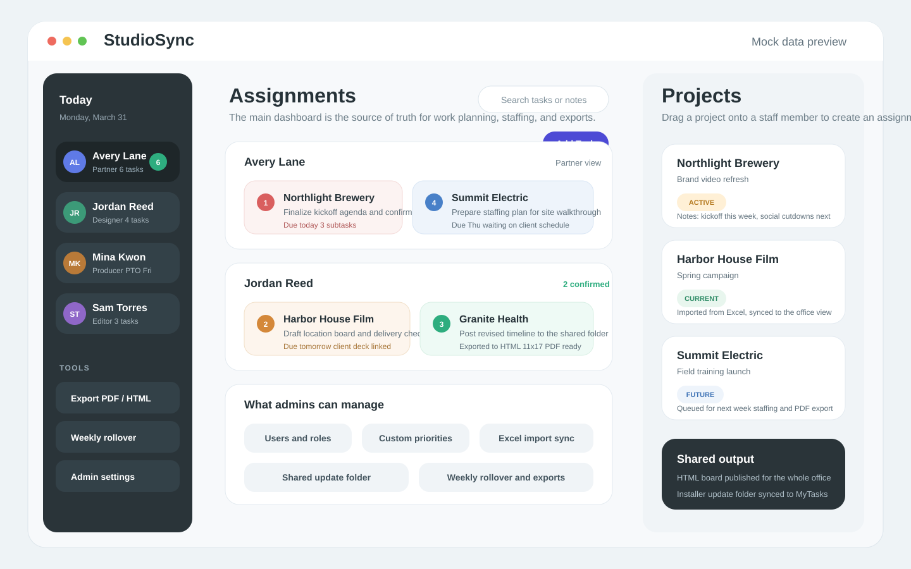
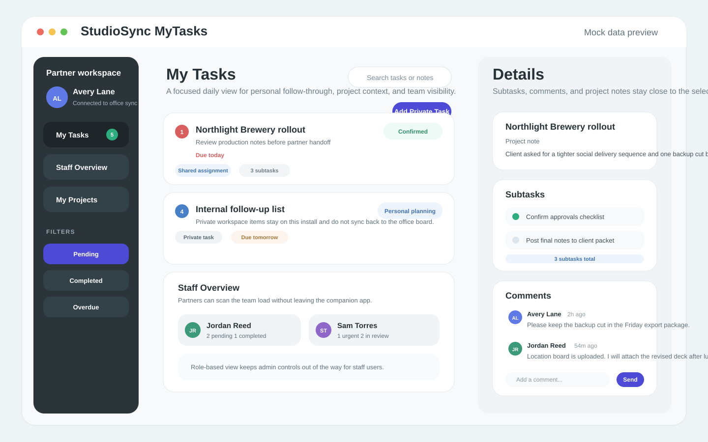

<p align="center">
  
</p>

# StudioSync

StudioSync is a two-app Windows scheduling system for small production and professional-services teams that need a clear daily board in the office and a lighter personal workspace on each desktop.

- `StudioSync` is the main dashboard used to plan work, manage people, import projects, and publish office-wide updates.
- `StudioSync MyTasks` is the companion app used by partners and staff to track assigned work, add follow-up notes, and stay in sync with the main board.

Both apps are Electron-based, store data locally in SQLite, and synchronize through a shared-drive event system instead of a central server database.

## Product overview

### StudioSync

StudioSync is the source of truth for the office schedule. It is designed for the team member who needs to see staffing, assignments, and project load all at once.

Core capabilities:

- Create, assign, prioritize, confirm, and reorder tasks across the team
- View staff workload with task counts, PTO indicators, and drag-and-drop assignment
- Import and refresh projects from Excel
- Manage custom priorities, business roles, and user records
- Export the schedule as PDF and HTML for office-wide visibility
- Configure a shared update folder used by both apps
- Run the weekly rollover flow to carry unfinished work forward cleanly



### StudioSync MyTasks

StudioSync MyTasks is the day-to-day desktop companion. It gives users a focused workspace for the items they need to finish without the admin-heavy controls of the main dashboard.

Core capabilities:

- View shared assignments synced from StudioSync
- Track private partner tasks that stay local to that install
- Review project notes alongside active work
- Open task details with subtasks and comments
- Filter by pending, completed, or overdue work
- Search task titles and notes quickly
- Let partners see staff workload from the companion app
- Detect new installers from the shared update folder



## How the apps work together

The two apps are meant to be used as a matched system:

- The main dashboard manages office-wide planning and shared data.
- Each MyTasks install keeps a local cache and syncs changes through shared-drive event files.
- Shared tasks, subtasks, comments, project notes, and settings stay aligned across installs.
- Private tasks in MyTasks remain local and are never pushed back to the office schedule.

## Repository layout

```text
.
|-- sd-scheduling/    # StudioSync main dashboard
|-- sd-companion/     # StudioSync MyTasks companion app
|-- .github/workflows/
|-- docs/
|-- DESIGN.md
|-- STRUCTURE.md
`-- README.md
```

More detailed architecture and file layout notes live in [`DESIGN.md`](DESIGN.md) and [`STRUCTURE.md`](STRUCTURE.md).

## Local development

Build StudioSync:

```powershell
cd sd-scheduling
npm ci
npm run build
```

Build StudioSync MyTasks:

```powershell
cd sd-companion
npm ci
npm run build
```

## Signed releases

GitHub Actions is configured in [`.github/workflows/release-signpath.yml`](.github/workflows/release-signpath.yml) to:

1. build both Windows installers on GitHub-hosted runners
2. upload the unsigned installers as workflow artifacts
3. submit both artifacts to SignPath for code signing
4. publish the signed installers and win-unpacked zip packages to the GitHub release for version tags

Push a tag like `v1.0.3` after the SignPath variables, project, and artifact configurations are in place.

## SignPath setup

Setup details are documented in [`docs/signpath-setup.md`](docs/signpath-setup.md).

## Screenshot note

The screenshots in this README use fully fictional mock projects, staff names, and comments created specifically for documentation. They do not contain live company data.
